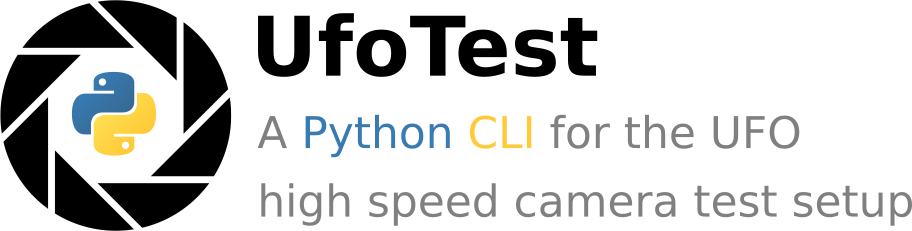

=======
ufotest
=======

.. image:: ../logo.png
        :alt: Logo

.. image:: https://img.shields.io/pypi/v/ufotest.svg
        :target: https://pypi.python.org/pypi/ufotest

.. image:: https://img.shields.io/travis/the16thpythonist/ufotest.svg
        :target: https://travis-ci.com/the16thpythonist/ufotest

.. image:: https://readthedocs.org/projects/ufotest/badge/?version=latest
        :target: https://ufotest.readthedocs.io/en/latest/?badge=latest
        :alt: Documentation Status

The ufotest project provides a command line interface to install and test the UFO camera, which was developed at the
Institute of Data Processing (IPE) of the Karlsruhe Institute of Technology (KIT).

* Free software: MIT license
* Documentation: https://ufotest.readthedocs.io.

Installation
------------

The easiest way to install this package is by using PIP. This will automatically install all the requirements and
also register the CLI commands to be usable.
(Note that the "sudo" is important to make the commands register correctly within the operating system)

.. code-block:: console

    $ sudo pip3 install ufotest
    $ ufotest init

Usage
-----

The command line can be accessed through the `ufotest` command within the console. Use the `--help` option to display
a list of all available commands or consilt the Documentation for a more detailed explanation

.. code-block:: console

    $ ufotest --help

Features
--------

- Global configuration file
- Automatic installation of all dependencies for a barebones operation of the UFO camera

Credits
-------

The following software was used in the creation of the project:

* Cookiecutter_: A CLI tool for project templating
* `audreyr/cookiecutter-pypackage`_: A basic template for python package projects

.. _Cookiecutter: https://github.com/audreyr/cookiecutter
.. _`audreyr/cookiecutter-pypackage`: https://github.com/audreyr/cookiecutter-pypackage
