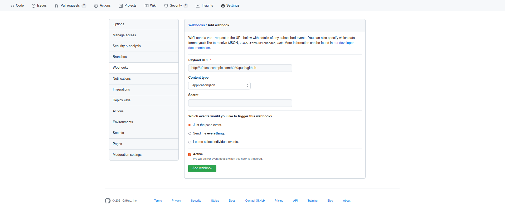

How to set up Github webhooks for automated builds
==================================================

One important feature of ufotest is automated builds. The system can be configured to build a new version
of software (and flash the hardware with it) for every push to a remote repository.

Prerequisites:

- :doc:`../../guides/config_public_hostname`: The web server has to be publicly accessible!
- The server needs to be running at all times where a push might occur

Specify the remote repo in the config file
------------------------------------------

First you need to specify the remote repository with the relevant code base in the config file:

.. code-block:: toml
    :caption: config.toml

    [ci]
        repository_url = 'https://github.com/username/repo.git'

This repository will be cloned every time to create the new software version to be tested

Go to Github and register a Webhook
-----------------------------------

