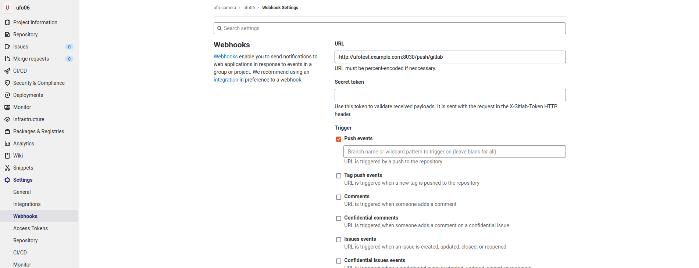

How to set up Gitlab Webhooks for automated builds
==================================================

One important feature of ufotest is automated builds. The system can be configured to build a new version
of software (and flash the hardware with it) for every push to a remote repository.

This can also be done using a *Gitlab* instance.

**Prerequisites:**

- :doc:`../../guides/config_public_hostname`: The web server has to be publicly accessible! Or at least it
  has to be in the same namespace so it is accessible by the Gitlab server. This may as well be a local
  network
- The server needs to be running at all times where a push might occur!

Specify the remote repo in the config file
------------------------------------------

First you need to specify the remote repository with the relevant code base in the config file:

.. code-block:: toml
    :caption: config.toml

    [ci]
        repository_url = 'https://gitlab.example.com/username/repo.git'

This repository will be cloned every time to create the new software version to be tested

Go to Gitlab and register a Webhook
-----------------------------------

Visit the Gitlab web interface for the repository in question. Navigate to "Settings -> Webhooks".
Enter the public hostname of your ufotest web server and use the url :code:`/push/gitlab`

Select only the checkbox for "Push events" as seen in the screenshot below, *Disable*
the SSL verification at the bottom of the page and and press "Add webhook"

